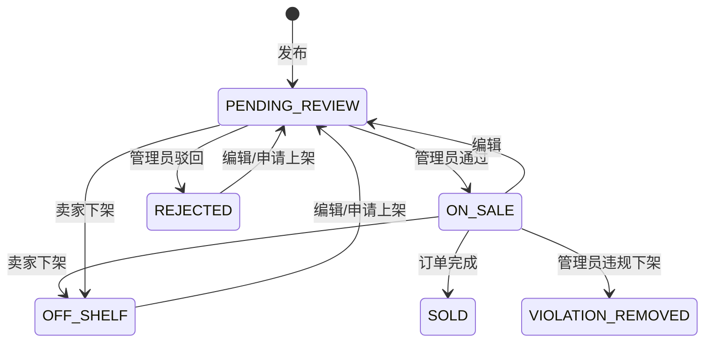
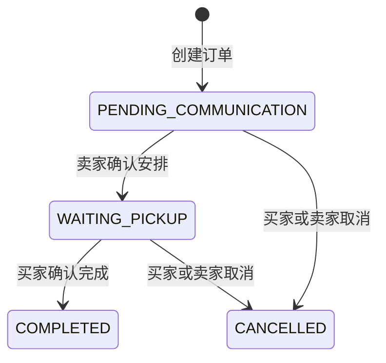

# EcoCampus RBAC 与访问边界

最近一次按 Spring Security、`CampusAccessGuard` 和各 service 复核：2026-07-14。

## 1. 当前身份模型

后端持久化角色只有：

| 角色 | 含义 |
| --- | --- |
| `USER` | 普通用户；交易能力还取决于核验状态和黑名单状态 |
| `ADMIN` | 管理员；后台 service 通过 `requireAdmin` 校验 |

`GUEST`、`PENDING_USER` 和 `SYSTEM` 只用于前端状态/产品概念，不是后端 `UserRole` 枚举，也不会写入 `users.role`。

核验状态：

| 状态 | 当前行为 |
| --- | --- |
| `UNVERIFIED` | 可登录、查看/更新基础资料、提交校园核验；不能执行交易操作 |
| `PENDING_REVIEW` | 枚举和数据库约束保留；当前没有异步审核流程 |
| `VERIFIED` | 可执行普通用户交易操作 |
| `REJECTED` | 枚举保留；当前没有管理员核验/驳回端点 |
| `BLACKLISTED` | 有效黑名单期内交易 service 返回 `423 BLACKLISTED` |

当前账号密码登录会在首次建档时直接创建 `USER/VERIFIED` 用户。`POST /auth/campus-verification` 提交后也直接设为 `VERIFIED`。因此“手机号验证码 + 学号人工二次审核”是旧规划，不是当前实现。

## 2. 鉴权分层

```text
Spring Security filter chain
  ├─ 公开端点：无需登录
  └─ 其他端点：要求有效 access token
        └─ service 层 CampusAccessGuard / 资源归属检查
             ├─ requireUser
             ├─ requireVerifiedUser
             └─ requireAdmin
```

Spring Security 对 `/api/v1/admin/**` 只做“已认证”检查；真正的管理员角色校验位于各后台 service。前端 `RouteGuard` 只是体验层，不是安全边界。

公开端点：

- `GET /api/v1/health`
- `GET /api/v1/categories`
- `GET /api/v1/items` 与 `GET /api/v1/items/{id}`
- `GET /api/v1/demands`
- `POST /api/v1/auth/login`
- `/actuator/health`、Swagger UI、OpenAPI

公开商品 GET 携带过期/无效 Bearer token 时会降级为匿名；其他公开端点若显式携带无效 token，当前 JWT filter 仍可能返回 401。

## 3. 当前权限矩阵

| 能力 | 访客 | 已登录未核验 | `VERIFIED USER` | `ADMIN` | 有效黑名单用户 |
| --- | --- | --- | --- | --- | --- |
| 浏览公开类目、在售商品、开放求购 | ✓ | ✓ | ✓ | ✓ | ✓ |
| 查看/更新自己的基础资料 |  | ✓ | ✓ | ✓（自己） | 更新被拒绝 |
| 提交校园核验 |  | ✓ | ✓ | ✓ | 被拒绝 |
| 管理自己的地址 |  |  | ✓ | 取决于核验状态 | 被拒绝 |
| 发布/编辑/上下架自己的商品 |  |  | ✓ | 不因 ADMIN 自动获得普通用户能力 | 被拒绝 |
| 收藏、私信、下单 |  |  | ✓ | 同上 | 被拒绝 |
| 查看/推进自己的订单 |  |  | ✓ | 同上 | 被拒绝 |
| 发布、查看自己的、关闭和匹配求购 |  |  | ✓ | 同上 | 被拒绝 |
| 商品审核/治理 |  |  |  | ✓ | `requireAdmin` 不检查核验状态 |
| 用户黑名单 |  |  |  | ✓ | 同上 |
| 一级类目管理 |  |  |  | ✓ | 同上 |
| 数据看板 |  |  |  | ✓ | 同上 |

当前没有“管理员查看全站订单”端点，也没有系统任务身份或定时求购匹配任务。

## 4. 资源归属

| 资源 | 归属字段 | 规则 |
| --- | --- | --- |
| 用户资料 | 当前 token 用户 id | 只能读写自己；后台用户列表另走管理员端点 |
| 地址 | `userId` | 只能管理自己的地址 |
| 商品 | `sellerId` | 卖家写自己的商品；管理员可审核/治理任意商品 |
| 收藏 | `userId + itemId` | 只能管理自己的收藏，不能收藏自己的商品 |
| 会话 | `itemId + userOneId + userTwoId` | 仅双方访问；一方必须是商品卖家 |
| 订单 | `buyerId + sellerId` | 仅买卖双方读取和按状态规则推进 |
| 求购 | `userId` | 公开列表可读开放求购；关闭、查看匹配仅所有者 |

## 5. 状态机

### 商品



代码枚举还包含 `DRAFT` 和 `DELETED`，但当前没有创建草稿或删除商品的 API。管理员违规下架除 `DELETED` 外可作用于其他状态；卖家不能编辑 `VIOLATION_REMOVED/SOLD/DELETED`。

当前实现还有一个状态校验漏洞：卖家下架方法只阻止 `SOLD/DELETED`，可将 `VIOLATION_REMOVED` 先改成 `OFF_SHELF`，再申请进入 `PENDING_REVIEW`。在修复前，不能把“违规下架不可由卖家恢复”视为已经由代码保证。

### 订单



同一商品同时最多一个活跃订单。完成订单会将商品设为 `SOLD`。

### 求购

新求购为 `OPEN`，所有者可转为 `CLOSED`。`MATCHED` 枚举已保留，但当前没有自动写入该状态的任务或端点。

## 6. 黑名单边界

- `requireVerifiedUser` 先检查有效黑名单，再检查 `verificationStatus == VERIFIED`。
- 当前黑名单用户不能查看历史订单、私信或自己的交易资源，因为这些读取同样使用 `requireVerifiedUser`。
- 设置带过期时间的黑名单后，过期不会自动把数据库状态恢复为 `VERIFIED`；`isBlacklisted()` 会变为 false，但状态仍为 `BLACKLISTED`，交易请求随后得到 403，直到管理员执行移出黑名单。
- 管理员不能拉黑自己。

## 7. 审计现状

当前会写 `audit_logs`：

- 商品创建、编辑、申请上架、下架、审核通过/驳回、违规下架。
- 订单创建和订单状态变更。

用户黑名单、类目 CRUD、资料/地址、收藏、私信和求购当前没有写通用审计日志。若扩展审计范围，应同时更新实现、API 契约和本文件。
