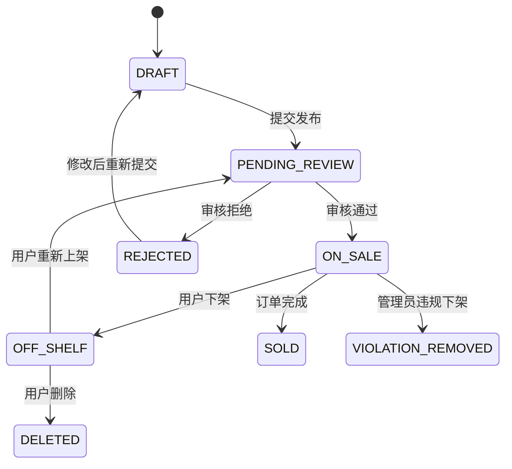
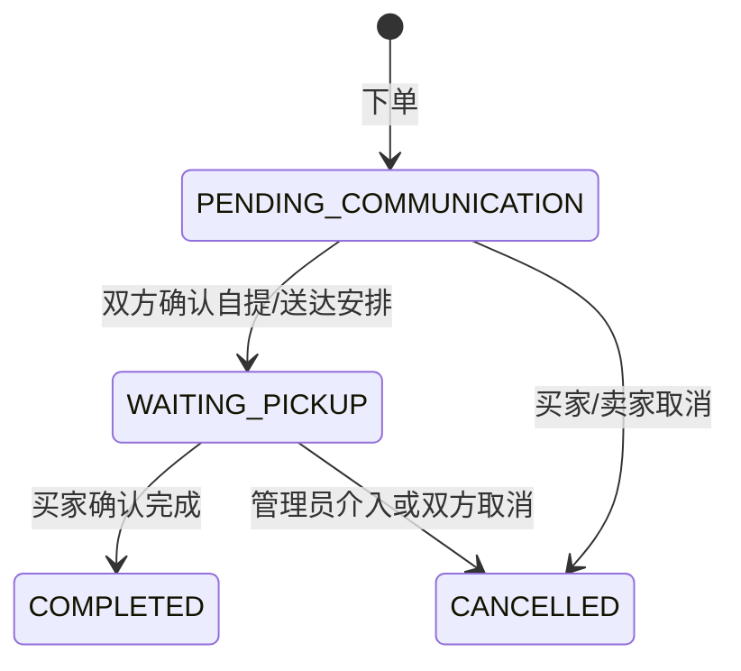

# EcoCampus RBAC 权限设计

## 1. 目标

EcoCampus 面向本校师生提供闲置物品流转能力，权限设计必须优先保证三件事：

- 只允许通过校园核验的用户参与交易，降低校外商贩入驻风险。
- 普通用户只能管理自己的信息、商品、订单、收藏、私信与求购需求。
- 管理员负责审核、治理和统计，不直接替用户完成交易。

## 2. 角色定义

| 角色 | 说明 | 典型用户 |
| --- | --- | --- |
| `GUEST` | 未登录访客，只能浏览公开信息和发起登录 | 未登录用户 |
| `PENDING_USER` | 已完成手机号登录，但校园身份未通过核验 | 待认证学生 |
| `USER` | 已通过手机号 + 校园学号双重实名认证的普通用户 | 本校学生/师生用户 |
| `ADMIN` | 后台管理员，负责审核、违规处理、类目与数据看板 | 项目运营/老师指定管理人员 |
| `SYSTEM` | 系统任务身份，用于自动匹配求购、关闭过期数据、写入系统事件 | 后端定时任务 |

> MVP 阶段只有普通用户和管理员两个显式业务角色，但实现时建议保留 `GUEST`、`PENDING_USER`、`SYSTEM`，避免认证流程和系统任务硬编码。

## 3. 用户状态

| 状态 | 说明 | 是否可交易 |
| --- | --- | --- |
| `UNVERIFIED` | 仅完成手机号登录，未提交校园信息 | 否 |
| `PENDING_REVIEW` | 已提交校园学号/实名材料，等待核验 | 否 |
| `VERIFIED` | 校园身份核验通过 | 是 |
| `REJECTED` | 校园身份核验失败，可重新提交 | 否 |
| `BLACKLISTED` | 被管理员拉黑，禁止发布、下单、私信和求购 | 否 |

## 4. 权限矩阵

| 模块 | 操作 | GUEST | PENDING_USER | USER | ADMIN | SYSTEM |
| --- | --- | --- | --- | --- | --- | --- |
| 认证 | 手机号验证码登录 | ✓ | ✓ | ✓ | ✓ |  |
| 认证 | 提交校园核验 |  | ✓ | ✓ |  |  |
| 认证 | 查看自己的核验状态 |  | ✓ | ✓ | ✓ |  |
| 用户 | 查看/编辑个人信息 |  | ✓ | ✓ | ✓ 自己 |  |
| 地址 | 管理自己的收货地址 |  |  | ✓ |  |  |
| 商品 | 浏览已上架商品 | ✓ | ✓ | ✓ | ✓ |  |
| 商品 | 搜索/分类筛选/关键词检索 | ✓ | ✓ | ✓ | ✓ |  |
| 商品 | 发布商品 |  |  | ✓ |  |  |
| 商品 | 编辑自己的商品 |  |  | ✓ |  |  |
| 商品 | 上下架自己的商品 |  |  | ✓ |  |  |
| 商品 | 审核商品 |  |  |  | ✓ |  |
| 商品 | 违规下架任意商品 |  |  |  | ✓ |  |
| 收藏 | 收藏/取消收藏商品 |  |  | ✓ |  |  |
| 私信 | 发起商品相关私信 |  |  | ✓ |  |  |
| 自提 | 预约自提 |  |  | ✓ |  |  |
| 订单 | 创建订单 |  |  | ✓ |  |  |
| 订单 | 查看自己的买入/卖出订单 |  |  | ✓ |  |  |
| 订单 | 推进自己的订单状态 |  |  | ✓ 买卖双方按规则 |  |  |
| 订单 | 查看全站订单记录 |  |  |  | ✓ |  |
| 求购 | 发布求购需求 |  |  | ✓ |  |  |
| 求购 | 编辑/关闭自己的求购需求 |  |  | ✓ |  |  |
| 求购 | 自动匹配对应商品 |  |  |  |  | ✓ |
| 后台 | 用户黑名单 |  |  |  | ✓ |  |
| 后台 | 类目管理 |  |  |  | ✓ |  |
| 后台 | 数据看板 |  |  |  | ✓ |  |

## 5. 资源归属规则

| 资源 | 所有者字段 | 访问规则 |
| --- | --- | --- |
| 用户资料 | `userId` | 用户只能读写自己，管理员只读或执行治理动作 |
| 收货地址 | `userId` | 仅本人可读写 |
| 商品 | `sellerId` | 卖家可编辑自己的商品；管理员可审核/下架 |
| 收藏 | `userId` + `itemId` | 仅本人可管理 |
| 私信会话 | `buyerId` + `sellerId` + `itemId` | 仅会话参与者可读写 |
| 订单 | `buyerId` + `sellerId` | 买卖双方可读，按订单状态推进 |
| 求购需求 | `userId` | 仅本人可编辑/关闭；系统可写入匹配结果 |

## 6. 状态机

### 6.1 商品状态

### 6.2 订单状态

订单状态中文展示：

- `PENDING_COMMUNICATION`: 待沟通
- `WAITING_PICKUP`: 待自提
- `COMPLETED`: 已完成
- `CANCELLED`: 已取消

## 7. 校园专属核验机制

推荐核验链路：

1. 手机号验证码登录。
2. 填写真实姓名、校园学号、学院/年级等基础信息。
3. 系统校验格式和唯一性，避免同一学号多账号绑定。
4. 管理员或学校统一接口完成二次核验。
5. 通过后授予 `USER` 权限；失败则回到 `REJECTED`。

风控建议：

- 同一手机号、同一学号、同一设备指纹、同一 IP 的异常批量注册需要记录。
- 被黑名单用户禁止发布、下单、私信、求购，但保留查看自己历史订单的能力。
- 商品审核要记录 `adminId`、审核时间、审核意见，方便追踪责任。

## 8. 后端实现建议

- Spring Security 统一处理登录态、角色和接口拦截。
- 资源归属判断放在 Service 层，不只依赖 Controller 注解。
- 管理动作写入审计日志，例如商品审核、违规下架、拉黑用户、类目变更。
- 数据库中角色和权限分开建模，MVP 可先用固定枚举，后续再扩展成可配置权限。

